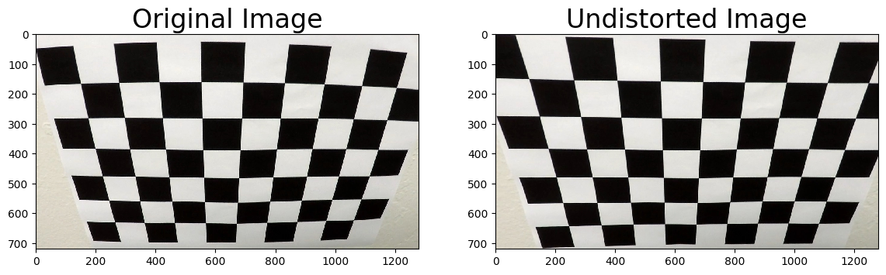
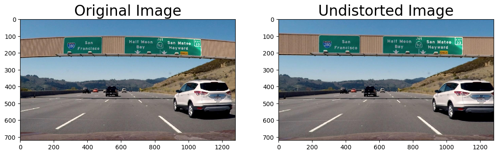
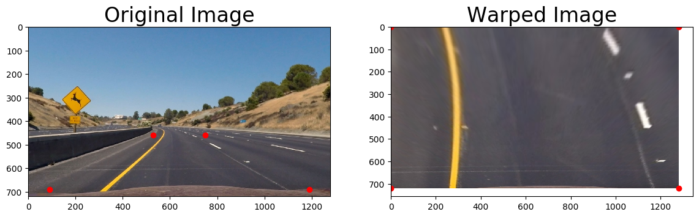
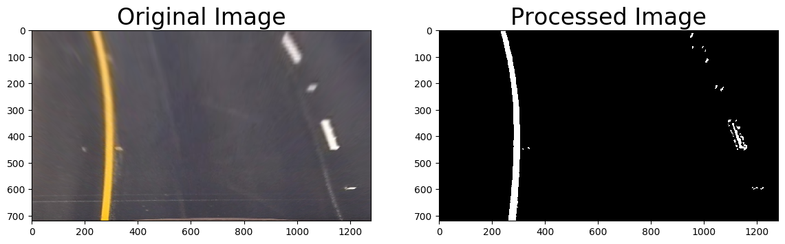
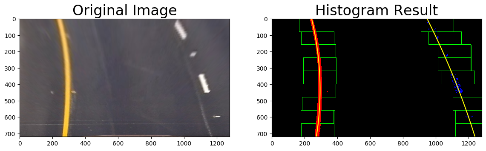
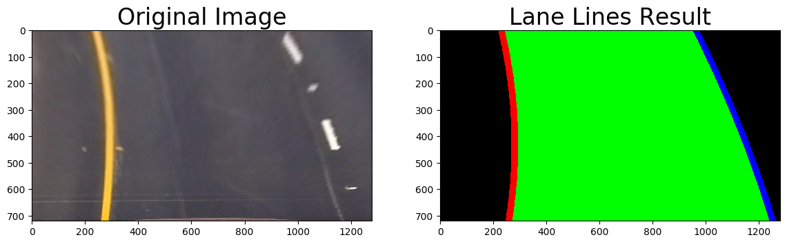
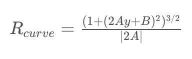
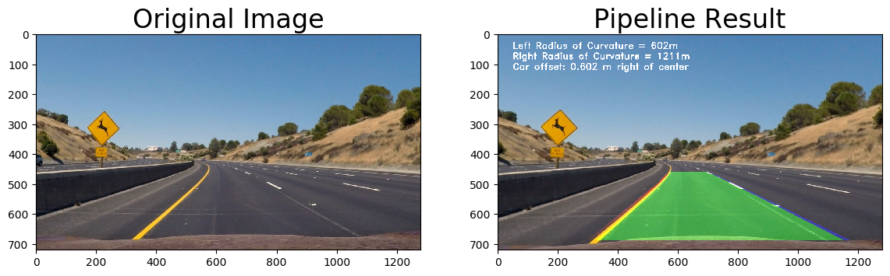

# Advanced Lane Finding

This project utilizes a software pipeline to identify the lane boundaries in a video.

The goals / steps of this project are the following:

* Compute the camera calibration matrix and distortion coefficients given a set of chessboard images.
* Apply a distortion correction to raw images.
* Use color transforms, gradients, etc., to create a thresholded binary image.
* Apply a perspective transform to rectify binary image ("birds-eye view").
* Detect lane pixels and fit to find the lane boundary.
* Determine the curvature of the lane and vehicle position with respect to center.
* Warp the detected lane boundaries back onto the original image.
* Output visual display of the lane boundaries and numerical estimation of lane curvature and vehicle position.

The images for camera calibration are in the `camera_cal` folder.  The images in `test_images` are used in testing the pipeline on single frames.  Examples of the output from each stage of the pipeline are the `ouput_images` folder.  The video `project_video.mp4` is target video for the lane-finding pipeline. 

## Camera Calibration

The code for this step is contained in `camera_calibration.py`
```
usage: camera_calibration.py [-h] [-show] [-save]

optional arguments:
  -h, --help  show this help message and exit
  -show       Visualize data calibration
  -save       Save calibration images
```
This script loads calibration images of chessboards taken at different angles.  Each image is grayscaled and sent into `cv2.drawChessboardCorners`.  The resulting "object points" are the (x, y, z) coordinates of the chessboard corners in the world.

For each set of corners, the output is displayed and shown to the user (if specified).  The image is also saved to disk (if specified).
  
Finally the corner points are sent to `cv2.calibrateCamera` to get resulting image points and object points.  This dictionary is then saved for reuse in undistorting other images in the pipeline.

 

##### Example chessboard images with corners drawn

## Pipeline
This sections includes all scripts and functionality to process images throughout the lane-finding pipeline.

### 1) Distortion correction

The `camera_calibration.py` script also contains a utility method for undistorting images based on the saved camera calibration dictionary.  This utility calls `cv2.undistort` internally.  The dictionary is loaded with the `load_calibration_data` method.





##### Example undistorted images next to the original image

### 2) Perspective transform 
Since perspective transform occurs after distortion correction, the discussion here follows that flow.

The code for this step is contained in `perspective_transform.py`
```
usage: perspective_transform.py [-h] [-show] [-save]

optional arguments:
  -h, --help  show this help message and exit
  -show       Visualize transform
  -save       Save transform image
```
The main method of this script loads all the "test*.jpg" files in the `test_images` directory and processes each one.

The process includes:
* Undistort the image
* Create mappings (a helper method to define four points in a polygon for perspective transform)
* Apply the transform using `cv2.getPerspectiveTransform` and `cv2.warpPerspective` (the inverse perspective is also calculated)
* Show the transform and/or save the image to disk (if specified)


##### Example perspective transform with mappings drawn for reference

### 3) Imaging methods

The code for this step is contained in `thresholding.py`
```
usage: thresholding.py [-h] [-show] [-save]

optional arguments:
  -h, --help  show this help message and exit
  -show       Visualize imaging process
  -save       Save processed image
```

This script expects undistorted images with the perspective transform already applied. 

The main method of this script loads all the "test*.jpg" files in the `test_images` directory and processes each one.

The process includes:
* Apply two Sobel filters in the x and y directions
    * The x direction sobel filter uses a threshold of 35 and 255
    * The y direction sobel filter uses a threshold of 15 and 255
* Do a bitwise AND function for the two sobel filters
* Apply two color masks in HLS and HSV color space
    * The HLS mask uses a threshold of 150 and 255
    * The HSV mask uses a threshold of 200 and 255
* Do a bitwise AND function for the two color filters
* Do a bitwise OR funtion on the combined sobel filters and combined color masks
* Finally apply a gaussian blur on the outputted image with a kernel of 9
* Show the processed image and/or save to disk (if specified)


##### Example binary image with combined sobel filters, color masks and gaussian blur

### 4) Identify lane line pixels and fit it with a polynomial

The code for this step is contained in `lane_localization.py`
```
usage: lane_localization.py [-h] [-show] [-save]

optional arguments:
  -h, --help  show this help message and exit
  -show       Visualize histogram and lane line images
  -save       Save histogram and lane line image
```

The main method of this script loads all the "test*.jpg" files in the `test_images` directory and processes each one.

The process includes two methods `histogram` and `find_lane_lines`.  

The output of `histogram` are two arrays from `np.polyfit` that can be used to paint left and right lanes.  The output also includes an image of the histogram slices for examples.  
The process includes:
* Calling the `thresholding.process_imaging(image)`
* Creating a histogram of the bottom 50% of the image
* Use a slicing technique to determine peak areas per slice
* Create data points for each peak in the slice for the left and right lanes


##### Example histogram slicing from warped undistorted image

The output of `find_lane_lines` is the left and right lane plot points, concatenated with `np.hstack`
The process includes:
* Extracting left and right line pixel positions
* Fit a second order polynomial to each
* Generating x and y values for plotting
* Red left lane, blue right lane and green polygon to illustrate the search window area


##### Example lane line painting from warped undistored image

### 5) Complete pipeline

The code for this step is contained in `pipeline.py`
```
usage: pipeline.py [-h] [-show] [-save]

optional arguments:
  -h, --help  show this help message and exit
  -show       Visualize pipeline image
  -save       Save pipeline image
```

The main method of this script loads all the "test*.jpg" files in the `test_images` directory and processes each one.  It also runs the `process_video` method which reads the video file and processes it using the `pipeline` function.

We use the previous measurements to continually update `curverad` which is used to calculate radius with the formula:


The distance from center makes two assumptions about the input video:

1) The camera is located dead-center on the car

2) The lane width follows US regulation (3.7m)


##### Example pipeline image with radius of curvature and vehicle position

## Pipeline (video)

[Output for project video](project_video_output.mp4)
